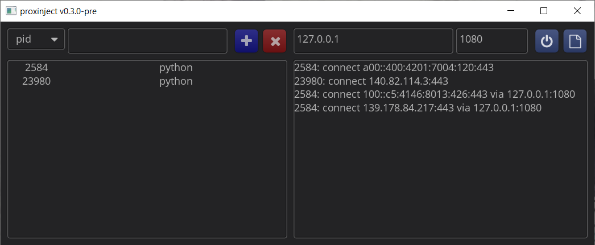

# proxinject
[](https://github.com/PragmaTwice/proxinject/actions/workflows/build.yml)
[](https://github.com/PragmaTwice/proxinject/releases)
[](https://github.com/microsoft/winget-pkgs/tree/master/manifests/p/PragmaTwice/proxinject)

*A socks5 proxy injection tool for **Windows**: just select some processes and make them proxy-able!*

## Preview

### proxinject GUI



### proxinject CLI
```
$ ./proxinjector-cli -h
Usage: proxinjector-cli [options]

Optional arguments:
-h --help                       shows help message and exits [default: false]
-v --version                    prints version information and exits [default: false]
-i --pid                        pid of a process to inject proxy (integer) [default: {}]
-n --name                       filename of a process to inject proxy (string, without path and file ext, i.e. `python`) [default: {}]
-e --exec                       command line started with an executable to create a new process and inject proxy (string, i.e. `python` or `C:\Program Files\a.exe --some-option`) [default: {}]
-l --enable-log                 enable logging for network connections [default: false]
-p --set-proxy                  set a proxy address for network connections (string, i.e. `127.0.0.1:1080`) [default: ""]
-w --new-console-window         create a new console window while a new console process is executed in `-e` [default: false]
```

## How to Install

- Download the latest portable archive (`.zip`) or installer (`.exe`) from the [Releases Page](https://github.com/PragmaTwice/proxinject/releases), or
- Type `winget install PragmaTwice.proxinject` in the terminal ([winget](https://github.com/microsoft/winget-cli) is required)

## Development Dependencies

### environments:

- C++ compiler (with C++20 support)
- Windows SDK (with winsock2 support)

### libraries: 
(you do not need to download/install them manually)

#### proxinjectee
- minhook
- asio (standalone)
- PragmaTwice/protopuf

#### proxinjector GUI
- asio (standalone)
- PragmaTwice/protopuf
- cycfi/elements

#### proxinjector CLI
- asio (standalone)
- PragmaTwice/protopuf
- p-ranav/argparse
- gabime/spdlog
